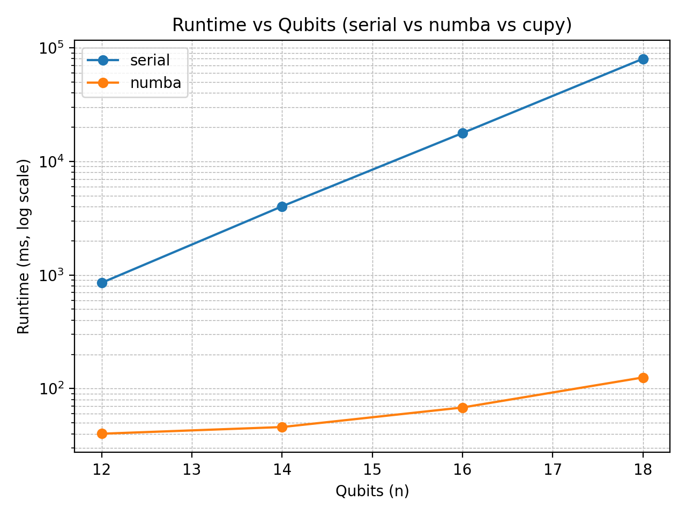
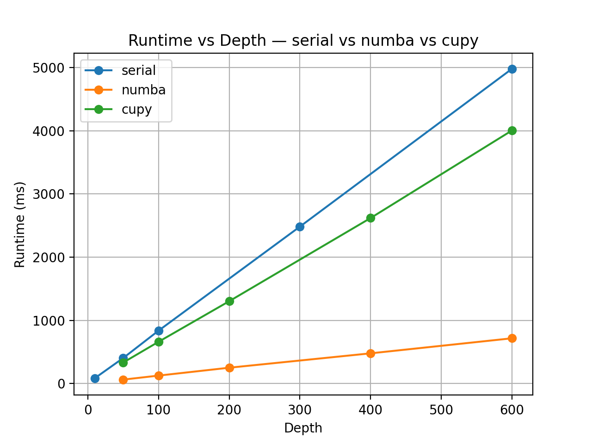
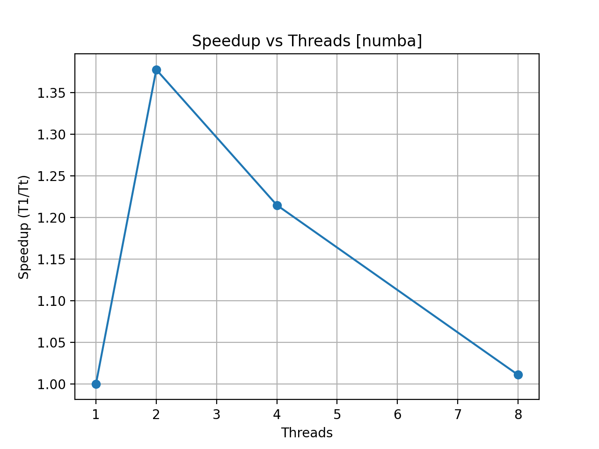
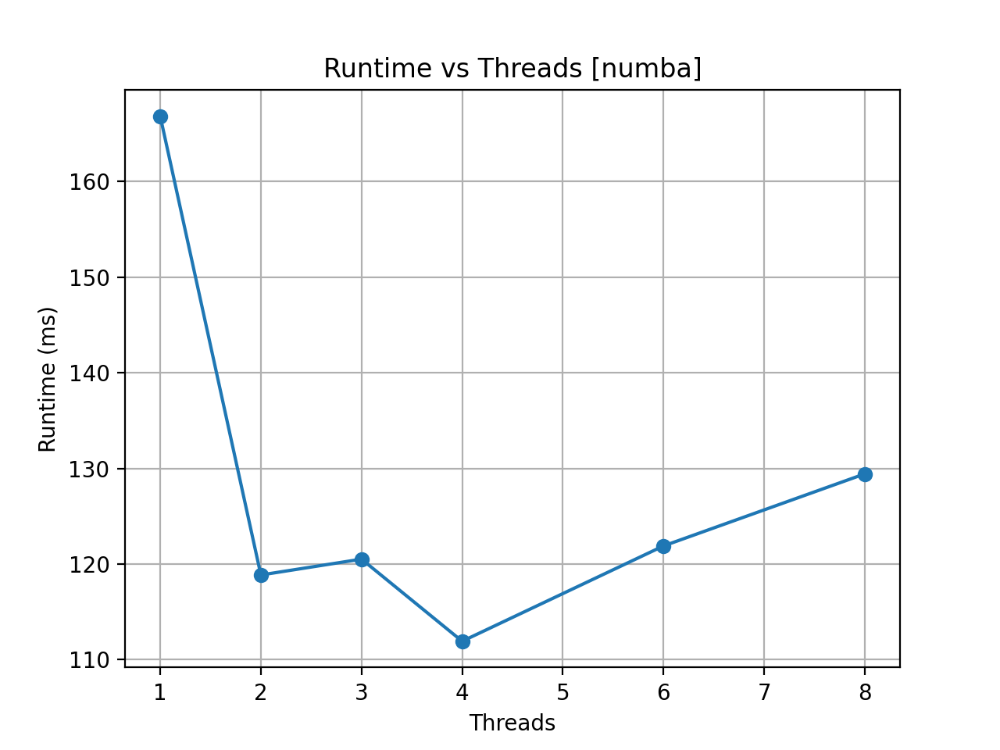

# Mini Real Quantum Simulator

## Introduction

This project implements a state-vector quantum circuit simulator designed to evaluate **parallel performance** on different execution backends.
It supports a minimal gate set (H, X, CNOT) and focuses on real-world performance scaling across three backends: Serial (NumPy), CPU-parallel (Numba), and GPU (CuPy). The goal is to understand how runtime grows with qubit count, circuit depth, and threads, and to compare CPU vs GPU performance.

## Motivation

Quantum state vector simulation has complexity that grows as (2^n) in the number of qubits (n). Realistic simulation of moderate qubit counts requires high performance. Many simulators focus only on correctness or fidelity, whereas this project emphasises **hardware-aware performance**: how serial vs shared-memory vs device-memory implementations perform in practice. The findings help answer:

- How does runtime scale with qubits and depth?
- At what point does GPU acceleration pay off?
- How efficient is CPU threading?
- What are the overheads (launch, memory) in GPU execution?

## Architecture

### Unified modular framework

The simulator is built as a **unified framework** with clearly separated modules for
**quantum gates**, **state management**, and **execution backends**.  
Each module has a single responsibility and communicates through simple interfaces:

- `gates.py` defines small 2×2 and 4×4 matrices representing logic operations.
- `state.py` manages allocation, normalization, and access to the quantum state vector of size 2ⁿ.
- `apply_serial.py`, `apply_numba.py`, and `apply_cupy.py` implement backend-specific `apply_*` routines that share identical semantics but target different parallel environments.
- `circuit.py` unifies these components through a consistent `Circuit.run()` method, ensuring that every backend can be swapped without changing circuit logic.

This modular design makes the framework easy to extend (for example, adding new gates, hybrid CPU+GPU execution, or MPI-based distributed backends) while keeping tests and benchmarking consistent across implementations.

### File layout

```
mini_qsim/
  python/
    gates.py           # Definitions of quantum gates (2×2, 4×4)
    state.py           # State object: vector of $2^n$ complex amplitudes
    apply_serial.py    # Baseline serial implementation (NumPy)
    apply_numba.py     # Parallel CPU implementation using Numba
    apply_cupy.py      # GPU implementation using CuPy (CUDA)
    circuit.py         # Circuit abstraction + run() method dispatching to chosen backend
    bench.py           # Benchmark harness: runs sweeps (qubits, depth, threads) and writes CSVs
    plot_results.py    # Aggregates results, produces plots and comparisons
    tests/             # Unit & cross-backend correctness tests
  data/
    serial/ numba/ cupy/   # Per‐backend results (CSV) + plots
```

### Gate set and conventions

- Supported gates:

  - X (Pauli-X): flips the target qubit.
  - H (Hadamard): places target into equal superposition.
  - CNOT (control → target): if control=1 then flip target.

- Basis ordering: **little-endian** ($|q_{n-1} \ldots q_{1} q_{0}\rangle$). Flipping bit ($1 \ll k$) corresponds to qubit $k$.
- Precision: default `complex64` for performance; `complex128` used only for small‐scale validation.
- Backends must preserve normalization ($|\psi|^2 \approx 1$) and match results across backends within tolerance.

### Backends overview

| Backend    | Library        | Model                  | Memory model             | File            |
| ---------- | -------------- | ---------------------- | ------------------------ | --------------- |
| Serial     | NumPy          | Single‐thread          | CPU shared memory        | apply_serial.py |
| Numba      | Numba (prange) | Multi‐core CPU threads | CPU shared memory        | apply_numba.py  |
| CuPy (GPU) | CuPy + CUDA    | Device parallel SIMT   | GPU device memory (VRAM) | apply_cupy.py   |

## Results

### Experiment types

- **Qubit scaling**: runtime vs number of qubits (depth fixed)
- **Depth scaling**: runtime vs circuit depth (qubit count fixed)
- **Thread scaling**: runtime vs number of threads (Numba only)
- **GPU vs CPU comparison**: matched runs for Numba and CuPy at identical (n, depth) to observe crossover.
- (Optional) Stride/memory‐bandwidth sensitivity and host/device overhead isolation.

## How to run

### Prerequisites

- Python 3.11+
- Libraries: `numpy`, `numba`, `matplotlib`
- For GPU: `cupy-cuda12x` (on a CUDA-capable GPU runtime, e.g., Colab Pro)
- Ensure sufficient RAM or VRAM for large state vectors (e.g., $2^{26}$ amplitude vectors ≈ 8 GB for complex64).

### Installation

```bash
git clone https://github.com/yourusername/mini_qsim.git
cd mini_qsim/python
python3 -m venv .venv
source .venv/bin/activate
pip install numpy numba matplotlib
# For GPU runs:
pip install cupy-cuda12x
```

### Running benchmarks

#### CPU serial baseline (Mac)

```bash
python -m bench qubits --ns 12,14,16,18 --depth 100 --backend serial
python -m bench depth  --n 12 --depths 10,50,100,300,600 --backend serial
```

#### CPU threaded (Numba)

```bash
python -m bench qubits --ns 12,14,16,18 --depth 100 --backend numba
python -m bench depth  --n 12 --depths 10,50,100,300,600 --backend numba
python -m bench threads --n 16 --depth 200 --threads 1,2,3,4,6,8
```

#### GPU accelerated (Colab)

```bash
python -m bench qubits --ns 20,22,24,26 --depth 200 --backend cupy
python -m bench depth  --n 22 --depths 50,100,200,400 --backend cupy
```

#### Plotting results

```bash
python -m plot_results
```

This reads all CSVs under `data/`, generates per‐backend plots, and combined comparison plots including GPU/CPU speedup.

## Interpreting results

- ### Cross-backend comparison

  Qubit scaling i.e. Runtime vs Qubits — Serial vs Numba vs CuPy
  <!--  -->
  <p align="center">
    
  </p>

  Depth scaling i.e. Runtime vs Qubits — Numba vs CuPy
  <p align="center">
    
  </p>

  Thread scaling
  <p align="center">
    
  </p>
  <p align="center">
    
  </p>
